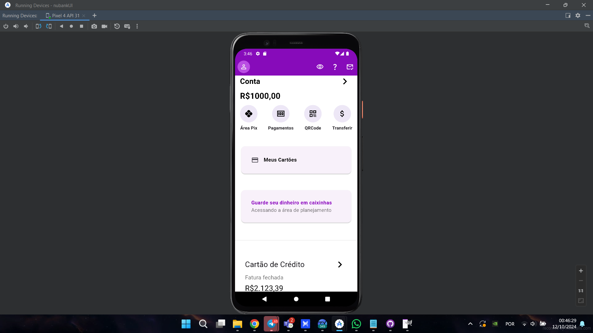
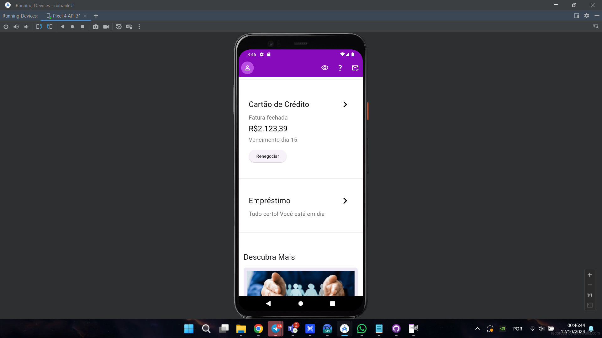
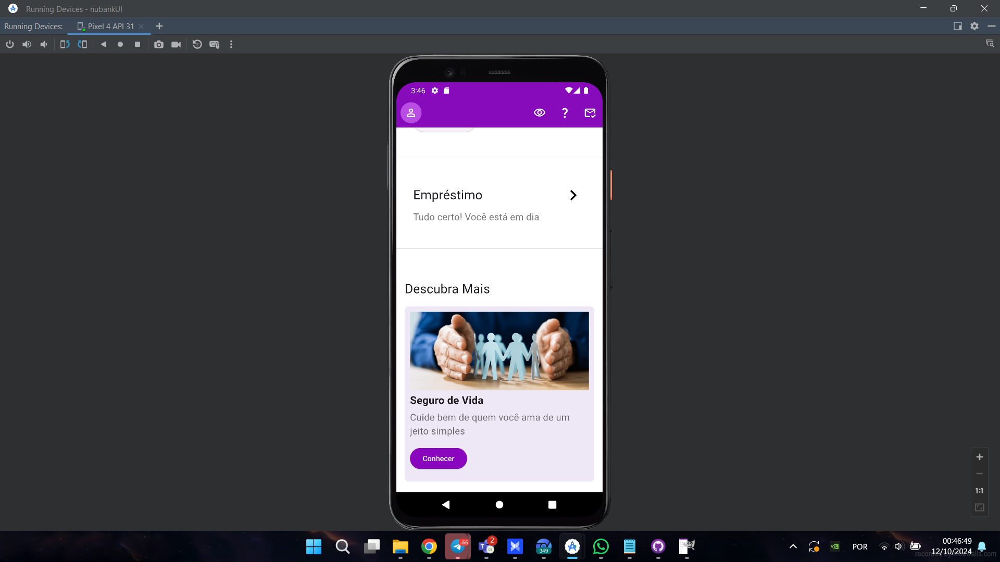

# Aplicativo Bancário Flutter
## Projeto Flutter desenvolvido por Cauã Sebastian

Nota: Este projeto é propriedade de Cauã Sebastian para disciplina de desenvolvimento mobile. Não copie o código sem permissão.

## Descrição
Este é um aplicativo Flutter que simula uma interface bancária, apresentando diversas funcionalidades como visualização de saldo, gerenciamento de cartões, empréstimos e descobertas de novos serviços. O aplicativo possui uma barra superior com ícones de navegação, exibe o saldo da conta, oferece botões de acesso rápido para serviços como Área Pix, Pagamentos, QRCode e Transferir, além de seções dedicadas a cartões de crédito, empréstimos e uma área para descobrir novos serviços.

# Imagens Da aplicação

 